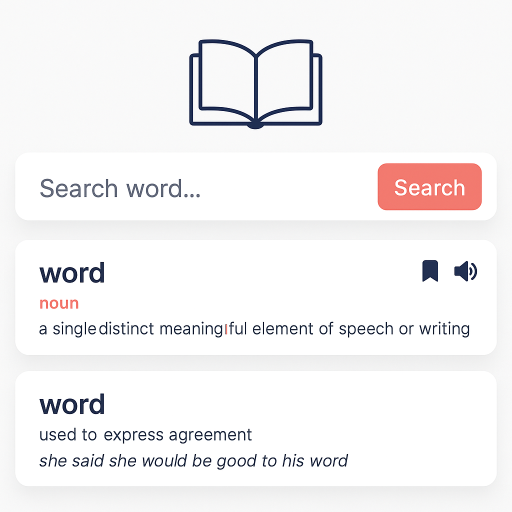

# Dictionary App

<div align="center">
  
</div>

A modern, responsive dictionary application built with React that helps you look up word definitions, meanings, and save your favorite words for quick reference.

<div align="center">
  <a href="https://anchalmish9630.github.io/Dictionary-app/" target="_blank">
    
  </a>
</div>

## Preview

<div align="center">
  
</div>

## Features

- **Word Search**: Look up definitions for any English word using the Dictionary API
- **Detailed Definitions**: View comprehensive definitions with parts of speech
- **Audio Pronunciation**: Listen to correct pronunciation of words (when available)
- **Bookmarks**: Save words to bookmarks for quick reference later
- **Responsive Design**: Works seamlessly on desktop and mobile devices
- **Modern UI**: Clean, intuitive interface built with Material-UI
- **Local Storage**: Bookmarks are saved locally in your browser

## Technology Stack

- **React 19.0** - Frontend framework
- **Material-UI v6** - UI component library
- **React Router Dom** - Client-side routing
- **Axios** - HTTP client for API requests
- **Styled Components** - CSS-in-JS styling
- **Dictionary API** - External API for word definitions

## Getting Started

### Prerequisites

- Node.js (version 14 or higher)
- npm or yarn package manager

### Installation

1. Clone the repository:
```bash
git clone https://github.com/yourusername/dictionary-app.git
cd dictionary-app
```

2. Install dependencies:
```bash
npm install
```

3. Start the development server:
```bash
npm start
```

4. Open [http://localhost:3000](http://localhost:3000) to view it in your browser.

## Usage

### Searching for Words
1. Enter a word in the search input on the home page
2. Press Enter or click the search icon
3. View the detailed definition, pronunciation, and examples

### Managing Bookmarks
1. While viewing a word definition, click the bookmark icon to save it
2. Access your saved words by clicking the bookmark button on the home page
3. Click on any bookmarked word to view its definition again

### Audio Pronunciation
- Click the play button next to a word to hear its pronunciation (when audio is available)

## API Integration

This app uses the [Free Dictionary API](https://dictionaryapi.dev/) to fetch word definitions and pronunciations. The API provides:
- Word definitions
- Parts of speech
- Phonetic transcriptions
- Audio pronunciations
- Example sentences

## Project Structure

```
src/
├── components/
│   ├── Home/           # Home page with search functionality
│   ├── Definition/     # Word definition display component
│   └── Bookmarks/      # Bookmarks management component
├── App.js             # Main application component
├── theme.js           # Material-UI theme configuration
├── index.js           # Application entry point
└── index.css          # Global styles
```

## Available Scripts

### `npm start`
Runs the app in development mode. Open [http://localhost:3000](http://localhost:3000) to view it in your browser.

### `npm test`
Launches the test runner in interactive watch mode.

### `npm run build`
Builds the app for production to the `build` folder. The build is minified and optimized for best performance.

### `npm run eject`
**Note: This is a one-way operation. Once you eject, you can't go back!**

## Features in Detail

### Home Page
- Clean, centered layout with search functionality
- Input validation (single words only)
- Direct navigation to bookmarks

### Definition Page
- Comprehensive word information display
- Multiple definitions with parts of speech
- Audio pronunciation capability
- Bookmark toggle functionality
- Navigation back to home

### Bookmarks Page
- List of all saved words
- Quick access to saved definitions
- Clean, organized layout

## Browser Support

This application supports all modern browsers including:
- Chrome (latest)
- Firefox (latest)
- Safari (latest)
- Edge (latest)

## Contributing

1. Fork the repository
2. Create your feature branch (`git checkout -b feature/AmazingFeature`)
3. Commit your changes (`git commit -m 'Add some AmazingFeature'`)
4. Push to the branch (`git push origin feature/AmazingFeature`)
5. Open a Pull Request

## License

This project is open source and available under the [MIT License](LICENSE).

## Acknowledgments

- [Free Dictionary API](https://dictionaryapi.dev/) for providing the word definitions
- [Material-UI](https://mui.com/) for the beautiful UI components
- [React](https://reactjs.org/) for the excellent framework
- Book icon and visual assets

---

Built with React and Material-UI
